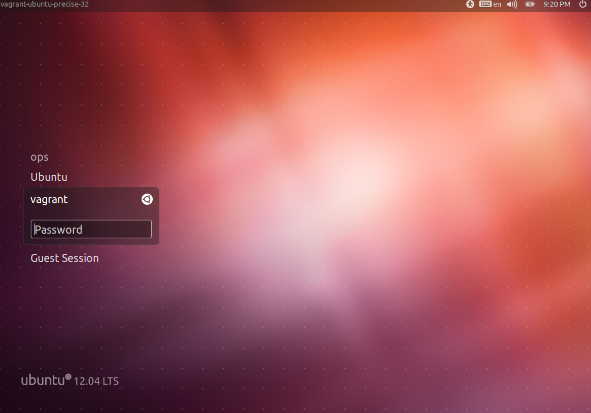

# 事前準備

# はじめに

チュートリアルを実施するための開発環境の設定について説明します。

# やること

* 開発用仮想環境の準備
* Rubyのインストール

# VirtualBox をダウンロード

[VirtualBoxの公式サイト](https://www.virtualbox.org/)からインストーラーをダウンロードし、インストールを実行してください。

# VMをダウンロード

[こちらのDropBox](https://www.dropbox.com/sh/j7n1ha8lvqmfuua/AACnryVkJEojKJ7Ue7M3YH-ia)から下記ファイルをダウンロード

* codeal_rails.vbox
* codeal_rails-disk1.vmdk

# VMを起動してログイン

先ほどダウンロードしたcoceal_rails.vbox をダブルクリック等で起動。

# vagrant ユーザーでログイン

VMを起動すると、vagrantユーザーのパスワード入力を求められるので、vagrantを入力。

{:relative_width="80"}

# 
